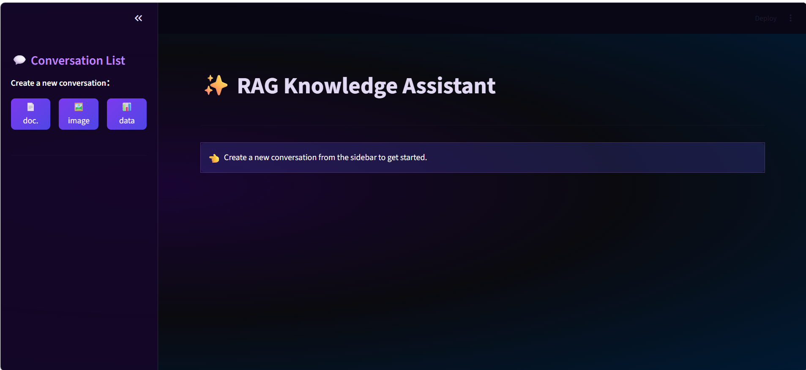
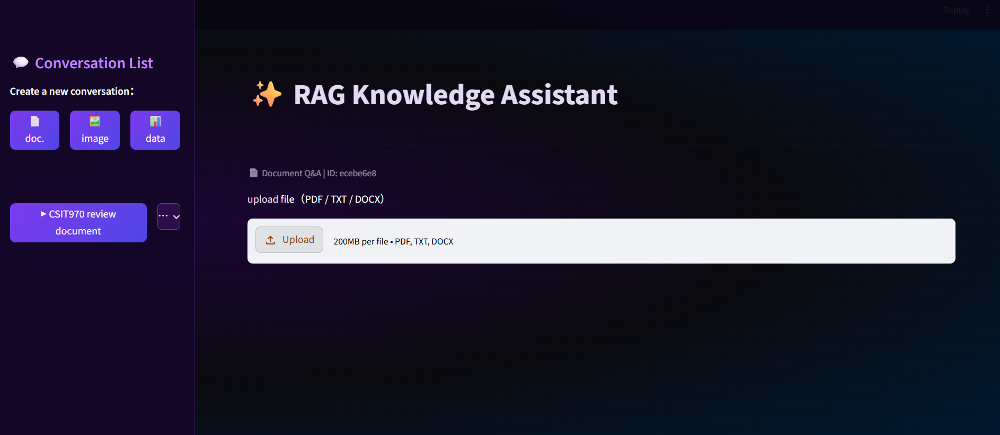
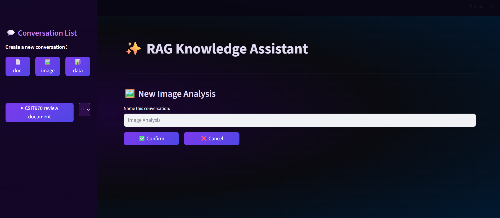
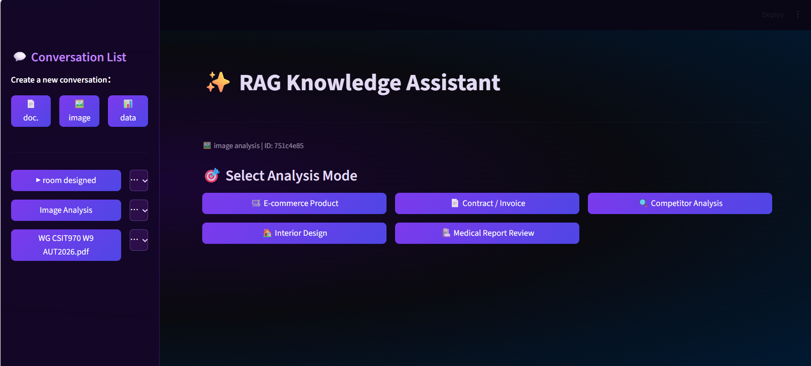
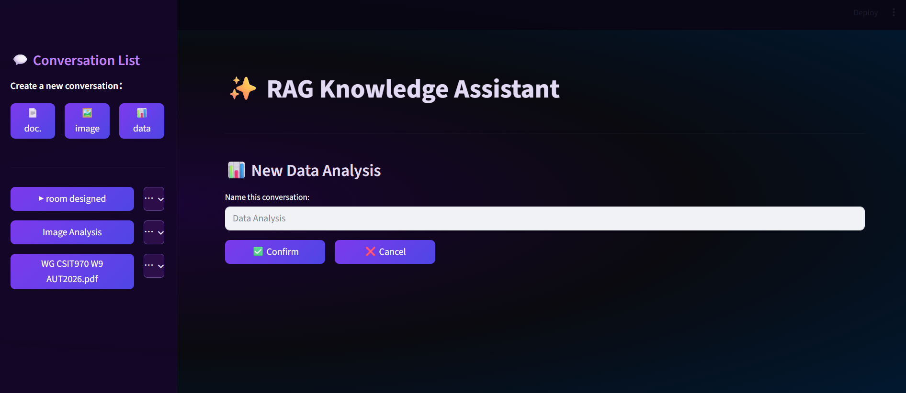
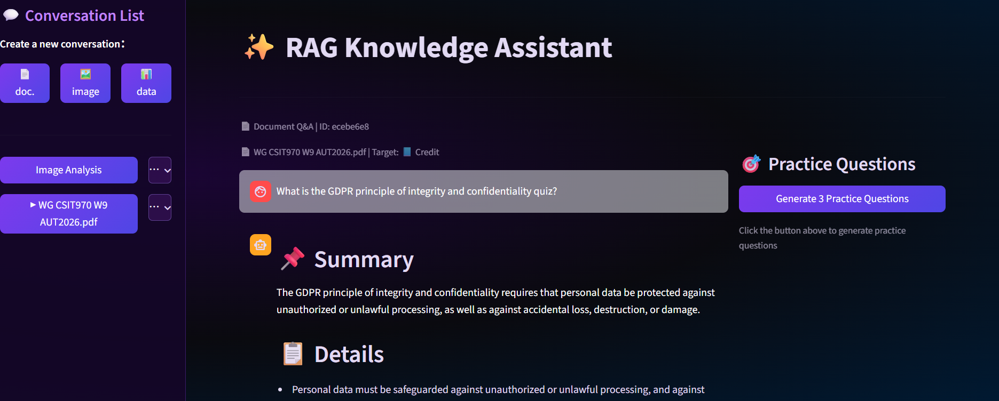
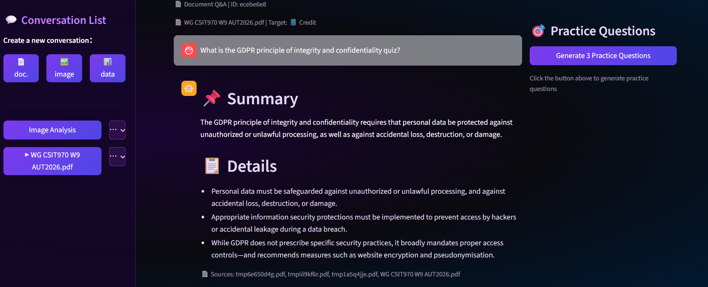
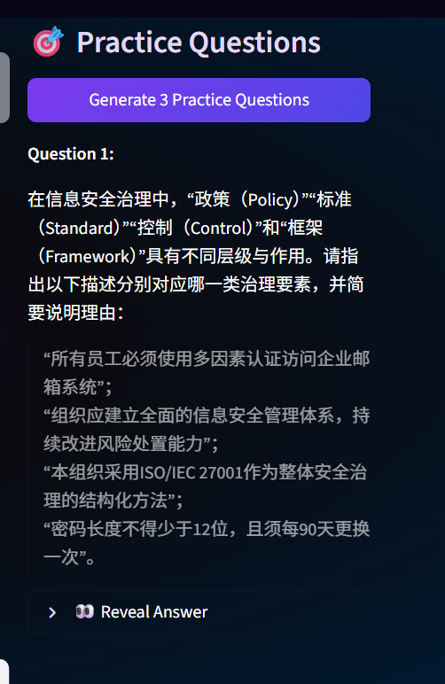
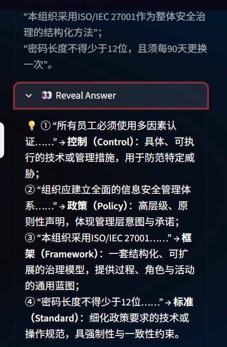

# ✨ RAG Knowledge Assistant

> An AI-powered document Q&A system built with LangChain, DashScope, and Streamlit.  
> Upload your documents — ask anything — get grounded answers with source references.


---

## 📸 Demo

<!-- 截图1：主界面 -->






<!-- 截图2：问答效果 -->



<!-- 截图3：出题功能 -->



---

## 🚀 Features

- **Multi-format Upload** — PDF, TXT, DOCX support with file management sidebar
- **RAG Pipeline** — Semantic chunking → DashScope Embeddings → Chroma Vector DB → MMR Retrieval
- **Grounded Answers** — Strictly answers from uploaded documents, no hallucination
- **Source Attribution** — Every answer cites the exact source file
- **Score Goal Mode** — Adjusts answer depth based on target grade (Pass / Credit / Distinction / HD)
- **Quiz Generator** — Auto-generates 3 practice questions from document content
- **Multi-Session** — Independent conversation sessions with custom names, pin, color labels
- **Image Analysis** — Visual Q&A powered by Qwen-VL-Plus (product, contract, competitor analysis)
- **Data Analysis** — CSV/Excel natural language queries + chart generation

---

## 🏗️ Architecture
┌─────────────────────────────────────────┐
│           Streamlit Frontend            │
│  Multi-Session │ Chat UI │ Quiz Panel   │
└──────────────────┬──────────────────────┘
│
┌──────────────────▼──────────────────────┐
│              RAG Pipeline               │
│  Load → Chunk → Embed → Store → Retrieve│
└──────┬─────────────────┬────────────────┘
│                 │
┌──────▼──────┐  ┌───────▼────────┐
│   Chroma    │  │  DashScope API │
│ Vector DB   │  │  qwen-plus     │
│  (local)    │  │  qwen-vl-plus  │
└─────────────┘  │  text-embed-v3 │
└────────────────┘

---

## 🛠️ Tech Stack

| Layer | Technology |
|-------|-----------|
| Frontend | Streamlit |
| LLM | Alibaba Cloud DashScope (qwen-plus) |
| Vision Model | Alibaba Cloud DashScope (qwen-vl-plus) |
| Embedding | DashScope text-embedding-v3 |
| Vector DB | Chroma (local persistent) |
| RAG Framework | LangChain + langchain-chroma |
| Document Loaders | PyMuPDF · Docx2txt · TextLoader |
| Data Analysis | Pandas · Matplotlib |

---

## ⚙️ Quick Start

### 1. Clone & Install

```bash
git clone https://github.com/xxz212/rag-assistant.git
cd rag-assistant
python -m venv .venv
.venv\Scripts\activate       # Windows
pip install -r requirements.txt
```

### 2. Configure

```bash
cp .env.example .env
# Add your DashScope API Key
```

Get your key at: https://dashscope.console.aliyun.com/

### 3. Run

```bash
streamlit run app.py
```

---

## 📁 Project Structure
rag-assistant/
├── app.py              # Streamlit UI + session management
├── rag.py              # RAG pipeline (load/chunk/embed/retrieve/answer)
├── vision.py           # Image analysis (qwen-vl-plus)
├── data_analysis.py    # CSV/Excel analysis + chart generation
├── session.py          # Session state management
├── requirements.txt
└── .env.example
---

## 💡 Key Design Decisions

**Why MMR Retrieval?**  
Maximal Marginal Relevance avoids returning duplicate chunks — improves answer coverage and diversity.

**Why DashScope instead of OpenAI?**  
Stable access for China-based clients without VPN. text-embedding-v3 outperforms ada-002 on Chinese text.

**Why session-based architecture?**  
Each conversation maintains independent vector stores and history — enables multi-user scenarios without data leakage.

---

## 🗺️ Roadmap

- [ ] Streaming output (token-by-token response)
- [ ] Persistent vector store (survive page refresh)
- [ ] Deployment on Streamlit Cloud
- [ ] Resume generator feature
- [ ] REST API (FastAPI backend)

---

## 👨‍💻 Author

Built by **Nate** — Master of IT student @ University of Wollongong  
Focused on AI application engineering and LLM-powered product development.

[](https://github.com/xxz212)

